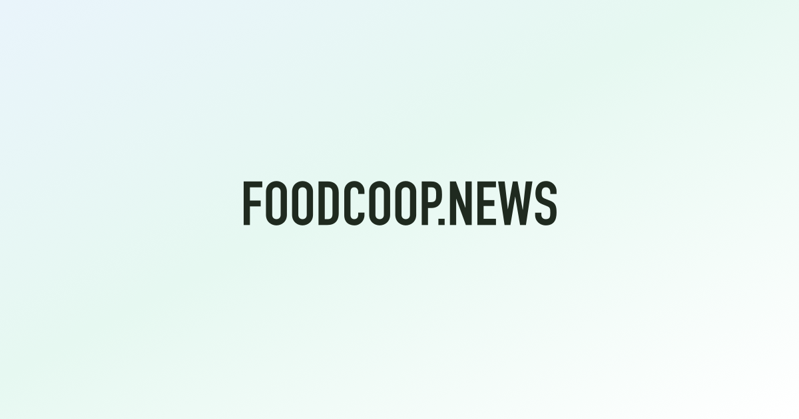

  

# foodcoop.news

[foodcoop.news](https://foodcoop.news) is a web app for Park Slope Food Coop members to stay up to date and manage their member tools in one place. Functionality has been featured on the [`@foodcoop` Instagram](https://www.instagram.com/stories/highlights/18038560394618051/) and the [Linewaiter's Gazette](https://linewaitersgazette.com/2025/05/13/may-13-2025-letters/)!

## Features

- Unified Discover feed for Coop announcements, Gazette posts, Food Coop Cooks updates, events, and Bluesky posts
- Filterable feed with recent-only items and rich media previews
- Email/password signup and sign-in
- Member profile settings (name, member ID)
- Unofficial member card preview
- Add member card to Apple Wallet or Google Wallet
- Shift calendar subscription with optional job-based filtering
- Add the shift calendar to Google Calendar, Outlook, or Apple Calendar
- At-a-glance coop open/closed status in the navigation
- Produce search with current listings and historical price trends
- Monthly produce analytics powered by DuckDB WASM

## Contributing

Contributions of all kinds are welcome, from bug reports and feature ideas to pull requests. Send feedback :)

## License

This project is licensed under the [MIT License](LICENSE).
