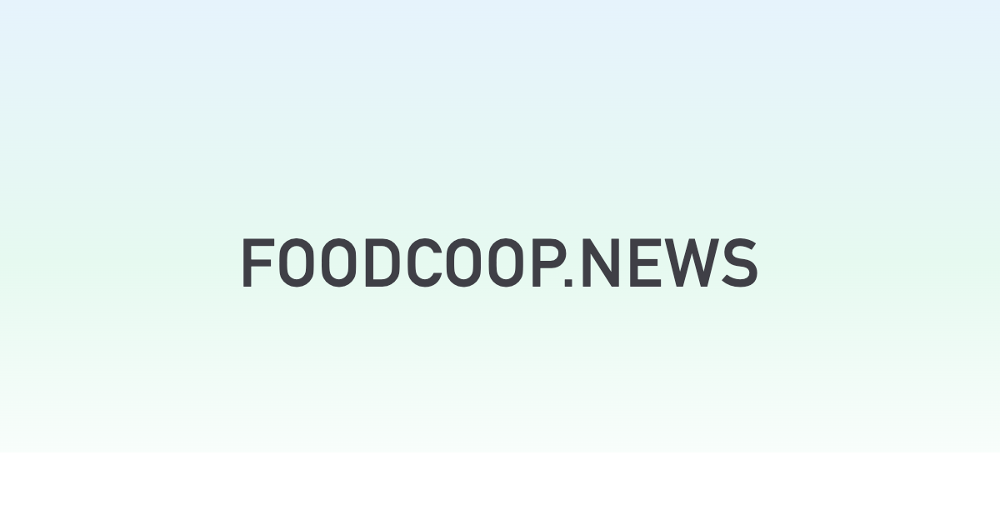

  

# foodcoop.news

[foodcoop.news](https://foodcoop.news) is a web app for Park Slope Food Coop members to stay up to date and manage their member tools in one place. Functionality has been featured on the [`@foodcoop` Instagram](https://www.instagram.com/stories/highlights/18038560394618051/) and the [Linewaiter's Gazette](https://linewaitersgazette.com/2025/05/13/may-13-2025-letters/)!

## Features

You can...

- Browse an assortment of feeds related to the Coop
- Produce inventory search with rich pricing information
- Read past, current, and upcoming agenda items for general meetings
- Add your Coop membership card to your Apple Wallet or Google Wallet
- Sync your favorite available work shifts to Google, Outlook, or Apple Calendar

## Contributing

Contributions of all kinds are welcome, from bug reports and feature ideas to pull requests. Send feedback :)

## Acknowledgments

Special thanks to [John Resig](https://johnresig.com/), former member of the web committee, for preserving and graciously sharing Park Slope Food Coop produce snapshot data from August 2013 through January 2026.

## License

This project is licensed under the [MIT License](LICENSE).
